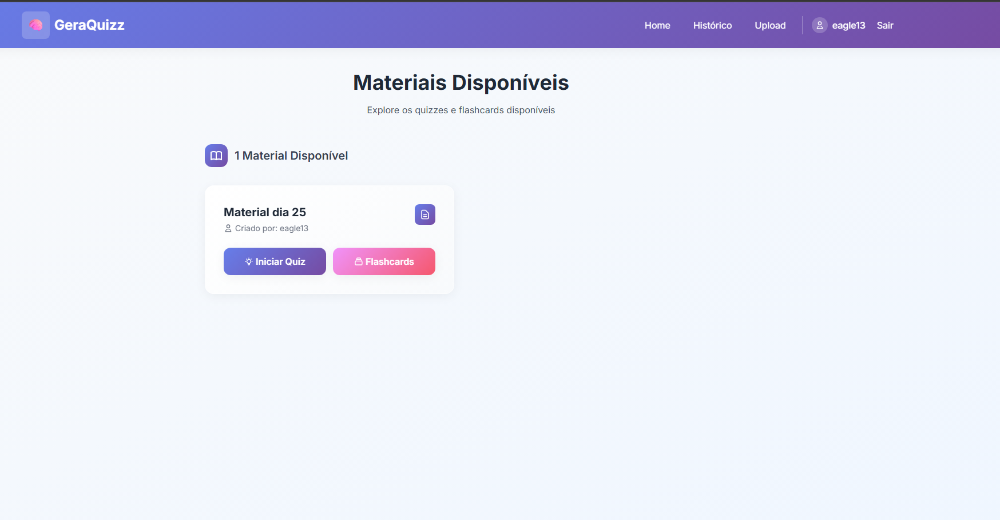
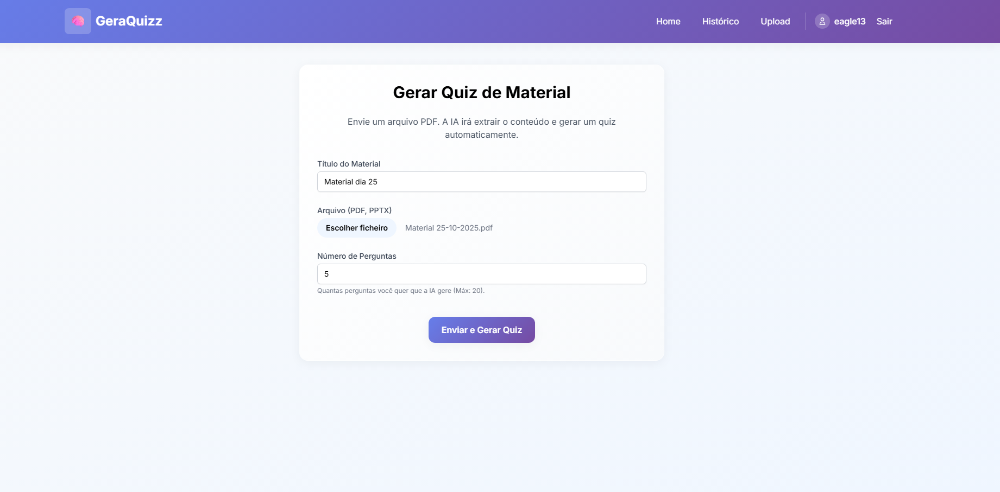
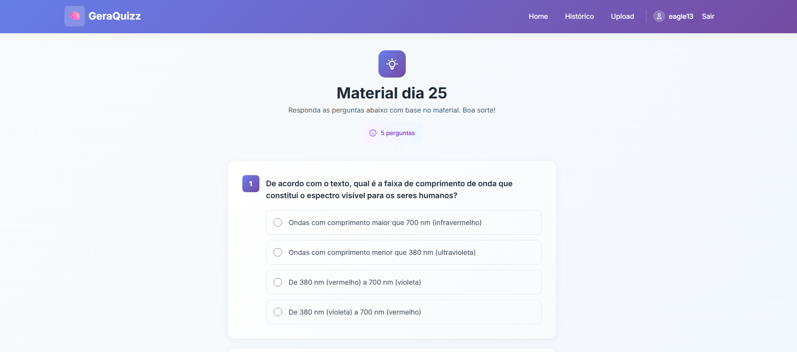
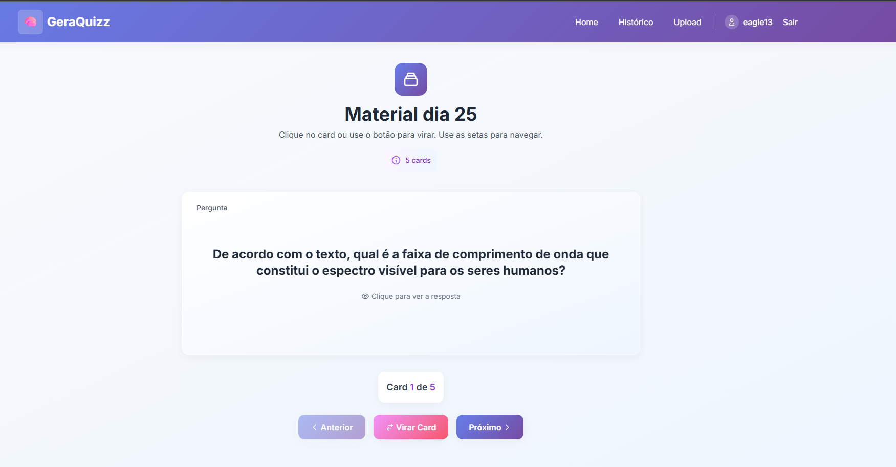
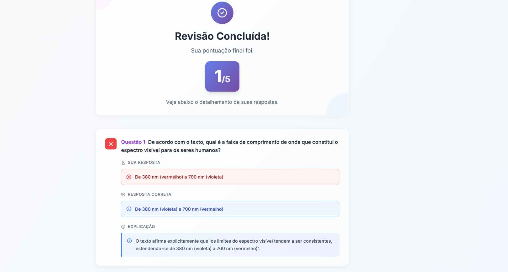

# 🚀 GeraQuizz - Micro Tutor com IA

GeraQuizz é uma aplicação web educacional desenvolvida em Python e Django. Ela transforma materiais de estudo (como slides de aula e PDFs) em ferramentas de revisão ativas, como quizzes interativos e flashcards, usando o poder da API Google Gemini.

O objetivo é otimizar o tempo de professores e instrutores, automatizando a criação de avaliações, e ao mesmo tempo fornecer aos alunos uma ferramenta de estudo personalizada e eficaz.

---

## 🖼️ Demonstração

|                 Tela Inicial (Dashboard)                 |                      Tela de Upload                      |
|:--------------------------------------------------------:|:--------------------------------------------------------:|
|  |  |

|                  Modo Quiz                   |                   Modo Flashcard                    |                 Página de Revisão                 |
|:--------------------------------------------:|:---------------------------------------------------:|:-------------------------------------------------:|
|  |  |  |


---

## ✨ Funcionalidades Principais

* **Autenticação de Usuários:** Sistema completo de registro (`/registrar`), login e logout com validação de formulários (email único, senhas correspondentes) e UI de "mostrar/ocultar senha".
  
* **Upload de Materiais:** Usuários podem fazer upload de seus próprios materiais de estudo em formato PDF, escolhendo o número de perguntas a serem geradas.
    
* **Geração de Quiz por IA:** Integração com a **API Google Gemini** para analisar o texto extraído, gerar perguntas, alternativas corretas e uma justificativa detalhada para cada resposta.
* **Modo Quiz:** Uma interface limpa onde o aluno pode responder às perguntas geradas e submeter para avaliação.
    
* **Modo Flashcard:** Um modo de estudo alternativo com animações 3D de "virar o card" para revisar perguntas e respostas.
    
* **Página de Revisão:** Após submeter um quiz, o aluno vê sua pontuação, quais perguntas errou/acertou, e a justificativa da IA para cada uma.
    
* **Histórico de Tentativas:** Uma página de "Histórico" onde o aluno pode ver todas as suas tentativas passadas e revisitar qualquer uma delas.
    
* **Painel Admin (Professor):** Uma visualização detalhada no Django Admin onde um superusuário pode revisar, editar ou corrigir as perguntas e alternativas geradas pela IA.


---

## 🛠️ Tecnologias Utilizadas

* **Backend:** Python 3, Django 5+
* **Frontend:** HTML5, Tailwind CSS (via CDN), JavaScript (Vanilla)
* **Geração de Conteúdo (IA):** Google Gemini API (`google-generativeai`)
* **Processamento de PDF:** PyMuPDF (`fitz`)
* **Banco de Dados:** SQLite 3 (padrão de desenvolvimento)
* **Variáveis de Ambiente:** `python-dotenv`

---

## ⚙️ Instalação e Configuração

Siga estes passos para rodar o projeto localmente:

### 1. Pré-requisitos

* Python 3.10+
* `pip` (gerenciador de pacotes do Python)
* Git

### 2. Clone o Repositório

```
git clone https://seu-repositorio-git/GeraQuizz.git
```


## 3. Crie um Ambiente Virtual (Venv)


### Windows
```
python -m venv .venv
.\.venv\Scripts\activate
```

### MacOS / Linux
```
python3 -m venv .venv
source .venv/bin/activate
```

## 4. Instale as Dependências

* Crie um arquivo requirements.txt na raiz do projeto e adicione o seguinte conteúdo:
```
requirements.txt
```
* Django>=5.0
* python-dotenv
* google-generativeai
* PyMuPDF

* Em seguida, instale-os:

```
pip install -r requirements.txt
```
## 5. Configure as Variáveis de Ambiente

* Crie um arquivo chamado .env na raiz do projeto (ao lado do manage.py). Este arquivo nunca deve ser enviado para o Git.
```
.env
```

### Chave secreta do Django (pegue a sua do settings.py)
```
SECRET_KEY='django-insecure-sua-chave-aqui'
```
#### Modo Debug (True para desenvolvimento, False para produção)
```
DEBUG=True
```

## Sua chave de API do Google Gemini
### Obtenha em: [https://aistudio.google.com/app/apikey](https://aistudio.google.com/app/apikey)
```
GEMINI_API_KEY='SUA_CHAVE_DE_API_DO_GEMINI_VAI_AQUI'
```
## 6. Aplique as Migrações do Banco de Dados
```
python manage.py makemigrations
python manage.py migrate
```
## 7. Crie um Superusuário (Admin)
```
python manage.py createsuperuser
```
(Siga as instruções para criar seu usuário admin)

## 8. Execute o Servidor
```
python manage.py runserver
```
Pronto! Acesse http://127.0.0.1:8000/ no seu navegador.

📖 Como Usar
Acesse http://127.0.0.1:8000/registrar/ para criar uma conta.

* Faça login.

* Na página inicial, clique em "Upload".

* Dê um título ao material, selecione um arquivo PDF e escolha o número de perguntas.

* Clique em "Enviar e Gerar Quiz" e aguarde o processamento da IA.

* Na página inicial, você pode escolher entre "Iniciar Quiz" ou "Estudar com Flashcards".

* Após completar um quiz, você pode ver sua "Revisão".

* Acesse a aba "Histórico" para ver todas as suas tentativas passadas.

(Opcional) Acesse http://127.0.0.1:8000/admin/ e faça login com sua conta de superusuário para revisar as perguntas geradas.
```
📁 Estrutura do Projeto (Simplificada)
GeraQuizz/
├── GeraQuizz/         (Config. do projeto)
│   ├── settings.py    (Configurações, .env, MEDIA)
│   └── urls.py        (Rotas principais: /admin, /login, /registrar)
│
├── core/              (App principal da aplicação)
│   ├── migrations/    (Schema do BD)
│   ├── templates/     (Todos os arquivos HTML)
│   │   ├── registration/
│   │   ├── base.html
│   │   ├── home.html
│   │   ├── ... (etc.)
│   ├── admin.py       (Config. do painel admin)
│   ├── forms.py       (Formulário de registro customizado)
│   ├── models.py      (Modelos de dados: Material, Pergunta, etc.)
│   ├── services.py    (Lógica de extração de PDF e chamada da API Gemini)
│   ├── urls.py        (Rotas do app: /home, /quiz, /upload, etc.)
│   └── views.py       (Lógica de cada página: home, registrar, etc.)
│
├── docs/
│   └── screenshots/   (PRINTS DAS TELAS)
│       ├── Cards.png
│       ├── Quizz.png
│       ├── ... (etc.)
│
├── media/             (Onde os PDFs enviados são salvos)
├── .env               (NÃO ENVIAR AO GIT)
├── .gitignore         (Ignora .env, media/, db.sqlite3, etc.)
├── manage.py          (Utilitário do Django)
└── requirements.txt   (Dependências do Python)
```


